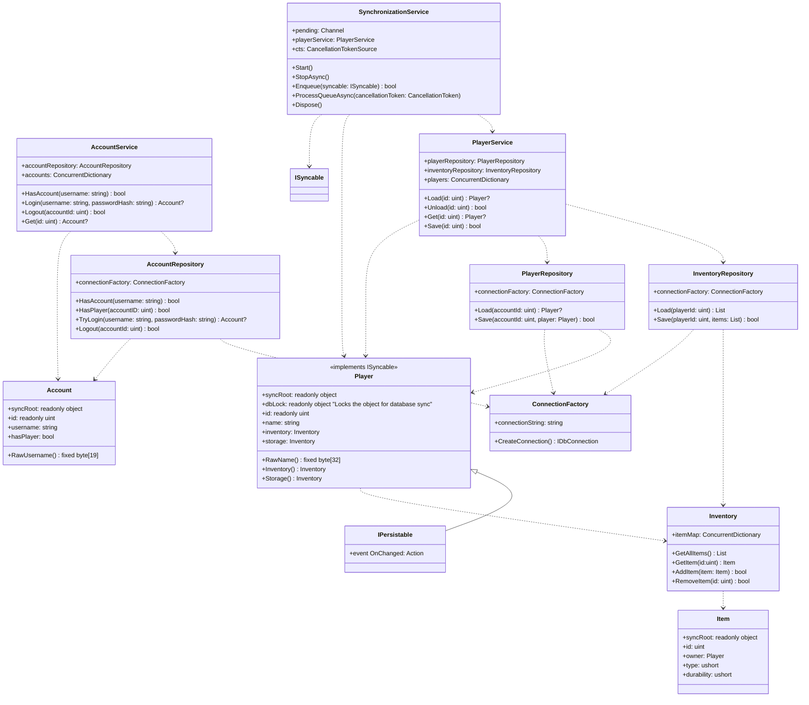

Hello,

I am currently working on building a server emulator for the game "Face of Mankind" using C#. I have most of the server
framework in place but I'm working on a few more pieces. I am interested in working with you as a partner to bounce ideas
off and get feedback from. Think of yourself as a rubber duck that talks back! My queries will almost entirely be aimed at
discussing architecture and performance. In the interest of ease-of-communication, I'd like to avoid receiving code
samples unless I ask for them. I also tend to ignore offers to do things, so in most cases, those feel superfluous.
I'm really good at asking about the things I need or care about!

With that in mind, I'd like to supply some context about the project to give you a clear picture of how it works.

To begin, the project is comprised of a few different components:

- **RakNet 3.611**: Face of Mankind uses this version of RakNet for network communication. Rather than trying to
  figure out packet structures and connection management, I'm using the original version of RakNet via a static library.
- **FOMNetwork**: A C++ shared library that serves as a layer of glue between RakNet and the game servers. This contains the
  packet structs and serialization functionality for reading and writing said packets.
- **ServerShared**: A C# library containing code shared between the different types of servers the game has. This contains the
  C# packet definitions and all of the interop code. It is built with multi-threading in mind. It has a dedicated thread for
  receiving and sending packets because RakNet does not support multi-threading.
- **MasterServer**: The game's architecture expects there to be two kinds of servers. This one is for functionality that is
  persistent regardless of the world the player is connected to.
- **WorldServer**: This server is for communicating player updates and manages most of a player's behavior. It contains things
  like the inventory, combat, and all of that fun stuff. All of the game's servers run the same "World Server" executable.
  The only difference is that a different "worldID" will make the client load a different map, but otherwise, it's all the same.

## Notable Design Elements

- Marshalling data for interop is expensive and we have taken great lengths to avoid it. _All_ of the structs passed through
  the interop boundary are blittable. This is guaranteed with C# compile-time checking of the types being blittable and a runtime
  check where C# sends the struct sizes and field offsets to native code and has them compared to the native data structures.
- Packets are high-throughout and generating gen0 garbage for every packet would be unnecessary pressure. Heap allocations are
  eliminated by passing pinned re-usable buffers to native code so that deserialized structs can be written into managed memory.
  These buffers are re-usable static variables and sized to receive packets in batches. This avoids any allocations and packets
  are, from top to bottom, essentially zero-copy.
- Face of Mankind was mostly server-authoratative. The only exception was player movement and combat. The world server does NOT run
  any kind of world simulation and simply trusts the client to send its position, animation states, and in combat, it tells the server
  where it hit another player. For now, the best we can do is prevent movement-based hacks by validating movement speed and checking
  for impossible movement directions.
- We do not have the source code for the game client and so packets must strictly adhere to what the client
  sends and expects to receive.
- `Dapper` is being used as the database library with a comfortable use of `public readonly record` inside repository
  classes to add powerful queries with type-safety. I am also using `FluentMigrator` for my database migrations to make it
  easy to maintain the schema as well.
- All of the World Server connect to the Master Server. There are a few types of packets that are passed between them and we
  re-use all of the existing infrastructure for that communication.
- Client<->Server and Server<->Server packets share the same basic infrastructure.
- Database reads/writes are mostly done in a dedicated update thread. This is vital so that packet handler threads don't get stuck waiting.

### Tooling

- **CMake**: RakNet and FOMNetwork are compiled using CMake. I have also included `gtest`.
- **Visual Studio 2022**: I have a `.sln` with the three C# projects included. FOMNetwork is included as a Makefile project.
  It uses NMake props to run `cmake`. The benefit of doing it this way is that Visual Studio maintains a dependency graph for me
  and mixed-mode debugging works really well.
- **Docker Build + Test**: One of the big requirements is that the server needs to be able to run on Linux. For this reason, I have
  two Docker contains to make that happen. RakNet 3.611 requires GCC 4.8 to build. As a consequence, a CPP container with an old version
  of Ubuntu that has the compiler. The other container is for building using `dotnet`.
- **Docker Database**: There is a MariaDB container for a database to be used during local testing and development.

### Threading Model

Shared

- Networking Thread
  - RakNet _requires_ that its functions be called on the same thread. As a result, packet sending and receiving need to take
    place on the same thread. Received packets are dropped into a bounded `Channel<FOMPacket>`. Packets to be sent are placed in an
    unbounded `Channel<FOMPacket>` by other threads and sent out. Both of these `Channel` instances belong to the networking
    thread and are read/written to by other threads.
- Packet Handler Threads
  - Deserialized packets are read from the networking thread's `Channel<FOMPacket>` and handled. This lets us maximize
    the number of concurrent player packets we are processing to maximize throughput. One limitation of this approach is that
    packets may be processed out of order, however, the only non-atomic action is the player movement update packet. This can be addressed
    with a timestamp that ignores packets with older updates. I considered per-player channels and the like but the affected
    surface is small and easily mitigated.
- Logging Thread
  - Blocking I/O is bad and so log messages are dropped in a `Channel<LogEntry>` to be filtered and written to files and the console.
- Persistence Thread
  - Uses a `Channel<IPersistable>` queue to track requested database writes. When a change is made an atomic dirty flag will be set that
    prevents multiple enqueues before a sync has taken place. Before the sync the flag is cleared and a lock is placed to prevent
    persisting it at the same time in multiple threads. This lock does not block packet handlers, only other persistence threads.

Master Server

- Update Thread
  - Using `PeriodicTimer` to keep the thread from spinning too aggressively, this thread runs operations based on elapsed
    time and performs any tasks not directly related to packet handling.

World Server

- Update Thread
  - Using `PeriodicTimer` to keep the thread from spinning too aggressively, this thread runs operations based on elapsed
    time and performs any tasks not directly related to packet handling.

### Server Architecture

This is a theoretical diagram of the architecture that includes both servers. The main purpose of the diagram was to think through
how handlers would interact with services and how data would be persisted. This is not a reflection of the actual application
design and was a theoretical exercise.

